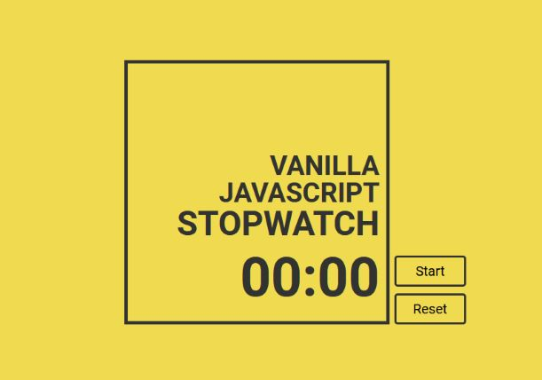

# My first vanillia stopwatch

## Description in English

---

A simple stopwatch created in JS. It works by calculating the difference between the current date and the start date of the stopwatch.

The original algorithm consisted of calculating the time spent in the pause and adding this time to each to the time of the stopwatch. Thus, the difference between the start of the stopwatch and the present time gave the correct result. But this method has its own difficulties and it is also more resource-intensive, so now another, simpler and more effective method is used.

The new method is to save the elapsed time and add it to the time of the new cycle after a pause. The difference is in fewer calculations and if checks.

## Описание на Русском

---

Простой секундомер созданный на ванильном JS. Алгоритм работает на вычислении разницы между текущей датой (временем) и датой начала работы секундомера

Изначальный алгоритм состоял на подсчете времени проведенной в паузе и добавлению этого времени к каждому к времени секундомера. Таким образом разница между началом секундомера и настоящим временем давала правильный результат. Но такой метод имеет свои сложности а так же он более ресурсоемкий поэтому теперь используется другой, более простой и эффективный метод.

Новый метод заключается в сохранении прошедшего времени и добавлении его к времени нового цикла после паузы. Разница состоит в меньшем количестве вычислений и проверок если.